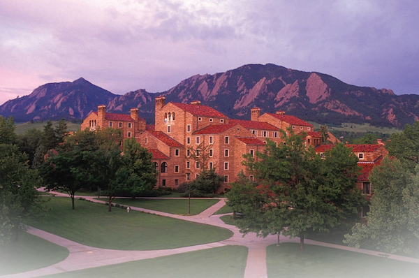

# 1 Introduction

This handbook should answer your questions about the rules and requirements of the department for your degree program. This information is also available [on the department website](http://www.colorado.edu/cs). In case you have questions or are unclear about the rules, it is best to talk to your Graduate Advisor.

## 1.1 Graduate Advisor

Rajshree Shrestha is the Computer Science Graduate Advisor. She oversees most aspects of department operation that will affect your stay here. She is here to help you graduate and is your first point of contact any time you have questions, problems, or need some help in any matter related to your studies.

Contact her at:

- Email address: [Rajshree.Shrestha@colorado.edu](mailto:Rajshree.shrestha@colorado.edu)
- Phone: 303-492-6361
- Office: ECOT 727
- Office Hours: Typically, between 9:30 am -- 12 pm and 1 pm -- 3:30 pm, Tuesdays, Wednesdays and Fridays

# 2 Facilities

## 2.1 Card Access

Access to all computing labs is controlled by card readers. Students use their Buff OneCard to gain access to the labs. Access authorization is typically given for the lab in which you are assigned desk space, the Computer Science Educational Lab (CSEL), which is ECCS 128, and conference rooms ECCS 1B06, ECOT 831/832. 

To gain access to your research lab, have your faculty advisor send an email to the front office administrator granting permissions. Then take your Buff OneCard to her, so she can give you access to your lab. 

Other secured doors in the Engineering Center also use your Buff OneCard and access must be arranged through whoever is in charge of that door. In particular, the entrance on the west side of the building has a Buff OneCard reader, which is useful if you need to get in when the building is locked on holidays. To get your Buff card activated for this entrance, here's what you have to do:

1. Photocopy your Buff Card
2. Write your name, department name, and advisor's name on the copy
3. Take the copy to the Dean's Office and ask one of the receptionists to give you access to the Engineering entrances. 

Keys to labs are not usually assigned to graduate students. If you feel that there is a reason an exception should be made in your case send email to the Graduate Advisor.

## 2.2 Computing Facilities

There are three different accounts that you might need. First, you'll need a university-wide IdentiKey account. You should have already received your IdentiKey username from the university. The IdentiKey account gets you into MyCuInfo, the CU student web portals where you can register for classes, check and pay your tuition bill, see your transcript, etc. In addition, the IdentiKey account is the one you will use when logging onto computing resources outside the department, such as the computer labs on the 2nd floor of the Engineering Center and the library, even the couple of computers in the gym. The university's Office of Information Technology (OIT) is in charge of the general University computing resources, and therefore administers the IdentiKey accounts. 

The Computer Science Educational Lab (CSEL) is located in ECCS 112 and ECCS 128. You may want to use a CSEL computer if one of your courses uses a CSEL provided resource (for instance, if you are expected to use MATLAB, which is installed in CSEL), or if you are a MS student who does not do research for a professor but needs computing resources here at school.  

Your Buff OneCard is required for access to the lab. Faculty, staff, and students (either in the CS department or enrolled in a CSCI course should have access to the CSEL resources. By default, your password for CS Department education systems is your IdentiKey password. Please [visit the CSEL website](http://csel.cs.colorado.edu/) for more information or email help@cs.colorado.edu for help, questions, or comments.

Now we'll cover email. Every CU student gets a CU email account. Your username here is unique university-wide. Usually the address is firstname.lastname@colorado.edu. You can access your email using your student portal.

## 2.3 Office and Desk Space

New PhD students will have desk space assigned to them by their advisor. Where you are placed is typically dependent on who your advisor is and in what general area your research interests lie. All PhD students should have a desk in a grad student lab. 

All labs should be equipped with white boards. If pens or erasers need to be replaced, please let main office administrator know and s/he will organize the replacement. 

## 2.4 Copy Machine

Graduate students who are TAs are entitled to use to the department copy machine in the main CS office. The main office administrator will assign an access number to you. Use of the copy machine is for teaching purposes only, and you are not expected to use all of the copies assigned to you each month. It is strictly prohibited to give your copier number to anyone else. You should not copy books or any other material that violates copyright laws.

# 3 Master's Degree

As of Fall 2017, the department of Computer Science offers **three** types of master's degree. 

1. Research based MS in CS -- Research based Master's in Computer Science degree is a more research focused degree and has two options. 
    - Thesis Option -- Students have to complete 24 credits of coursework and complete from a minimum of 4 to a maximum of 6 credits of MS Thesis credits and have to write a Thesis.
    - Non-Thesis Option - Students have to complete 24 credits of coursework accordingly their MS plan of study and complete 6 credits of independent study research work. Details of the course plan is listed below.

2. Course based MS in CS -- Introduced as of fall 2016, course based Master's in Computer Science degree offers various sub plans you may choose to specialize in. Students have to complete a total 30 credits of approved graduate level coursework. Each sub plan has its own requirements. Under every sub plan, students will have to fulfill their MS requirements and the sub plan requirements. The sub plans are as follows:
    - Data Science and Engineering (DSE)
    - Human Centered Computing (HCC)
    - Software Systems and Cloud Computing (SCC)
    - Intelligent Systems (IST)
    - Robotics (RBT)
    - Algorithms, Network and Optimization (ANO)
    - Numerical Computation (NUM)
    - General Track (GEN)

1. ME in CS -- Masters of Engineering in CS degree is a course based degree that can be completed online and is focused for working professionals. Students have to complete a total 30 credits of approved graduate level coursework.Students may also choose sub plan options under this degree.

## 3.1 The Plan of Study

This form lists the courses you plan to take to complete your degree. The courses listed on your Plan of Study are up to you and your advisor, subject to the general requirements of the degree. Students who are admitted conditionally must take the specific courses listed on their letter of acceptance. 

Your Plan of Study may be changed at any time with the approval of your advisor. It exists to protect both you and the Department. It ensures that you follow a course of study the Department deems worthy of a Master's degree. It also protects you from arbitrary changes in requirements by the Department. As long as you follow a signed Plan of Study and maintain a GPA of 3.0 or better, you will get your degree. Your Plan of Study should be completed by the end of your first semester in the program.

## 3.2 The Breadth Requirement

One major requirement for your degree is that you must receive a grade of B or better (not B-) in **four** graduate courses at the 5000-level, each one in a different area of Computer Science. The intent of this requirement is that you take the introductory graduate course in at least four areas. Masters of Engineering (ME) students are required to take courses in **three** of the nine different areas to fulfill the breadth requirement. 

If you already have such a course at another school, you can substitute a higher-level graduate course in that area, but you need to petition the graduate committee for approval. No transfer credits will count towards the breadth requirement unless you take an upper level course in the same area here at CU Boulder. 

The nine areas considered are artificial intelligence, computational biology, human-centered computing, numerical & scientific computing, programming languages, software engineering, database systems, systems & networking and theory of computing.

Please check the CS website [breadth course page](http://www.colorado.edu/cs/current-students/graduate-students/msme-breadth-requirement) for breadth courses per area. The purpose of this requirement is to assure the breadth of your knowledge in Computer Science. This requirement must be met by all students.

## 3.3 Taking Classes

Students in the Computer Science MS or PhD programs should enroll in all their CS courses as a Boulder campus student. 

### 3.3.1 Courses External to the Department

Up to 6 hours (two classes) may be taken in courses from other departments (4000 level or above, all CSCI courses must be 5000 level or above) provided that those courses have "significant Computer Science content" and are taught by a member of the graduate faculty. The student must file a petition to allow these credit hours to be counted toward the degree. This petition must explicitly verify the above requirements and must be approved by the student's advisor and the Graduate Director of the Computer Science department. You should seek approval for any out of department classes before the add/drop deadline. When considering out of department course, consider the following guidelines:

1. They must not be Computer Science or very similar to a course available in CS.
2. They must not be cross-listed with Computer Science.
3. They must have significant Computer Science content.
4. The instructor must be a member of the Graduate School faculty.
5. You will ALWAYS need to file a petition to the graduate committee.
6. You should discuss with the graduate advisor before the add/drop deadline

For example, you may want to take a senior-level math course in logic. Take note! Students in the past have been caught when their instructor was not a member of the Graduate School faculty! Tenure-track professors are almost always Graduate School faculty. Graduate Part-Time Instructors (GPTI) are almost never Graduate School faculty. For other instructors, it is a toss-up. Check with the instructor at the beginning of the semester to make sure. Remember, you only have to worry about this for 4000-level courses; almost all 5000-level courses or above are taught by Graduate School faculty. Still when in doubt talk to your graduate advisor.

### 3.3.2 Distances Courses

There is no limit on the number of distance classes a graduate student may take. International students may need to confirm with ISSS before enrolling in distance sections.  

### 3.3.3 Masters Pass/Fail Courses

No graduate courses may be taken for Pass/Fail credit. This includes graduate courses which are transferred into the program. You can take courses for No Credit but they will not count towards your degree.

## 3.4 Masters Transfer Courses

You may transfer up to NINE semester hours of courses from another university or from within CU (either taken as a non-degree student OR taken as a non-CS student). If you are transferring these courses from another college, you need to submit a Request for Transfer of Credit form. A Request for Transfer of Credit can only be submitted after completing at least **six** credits of graduate level course work with a grade of B or better and a minimum GPA of 3.25 at CU. Typically, this means you will need to wait to submit it until after the first semester. This form will need to be signed by your advisor and the Graduate Director of the department and then will be forwarded to the Graduate School for approval.

Courses taken within CU system, which you want transferred should be listed in the appropriate area on the Masters Application-for-Candidacy form (see Section [Application for Admission to Candidacy Form](applewebdata://0498032F-E975-4E8B-8B87-780218009473#_Application_for_Admission_1)). Once this form has been signed by your advisor and the Graduate Director of the Department, the credits for these courses are automatically transferred. Courses that were taken more than five years ago will have to be validated.

## 3.5 Research Based Masters in CS

To receive a Research based Masters in CS, you will need to maintain an overall GPA of 3.0, including having a grade of B or better (not B-) in courses in FOUR different areas of Computer Science (details in 3.1.2). You must complete your degree within four years of your entrance to the program.

In addition, you will need to decide between whether or not to do a Master's Thesis (known as Option I.) or to take 30 credit hours of coursework to meet your degree requirements (known as Option II.) 

### 3.5.1 Option I

Option I requires you to take 24-26 credit hours in coursework plus 4-6 credit hours of thesis to accumulate a total of 30 credit hours. You must also successfully defend your thesis and [upload your thesis electronically](http://www.etdadmin.com/colorado).

If you want to do a thesis, you must find a faculty member willing to be your advisor for that research. The Department's faculty is large enough that you can usually find someone willing to sponsor you and help select a topic appropriate for a Master's thesis in nearly every field of Computer Science.

### 3.5.2 Option II

Otherwise, you will need to take 30 credit hours of coursework to meet your degree requirements (known as Option II.) In these 30 hours, 6 hours must be independent study credits doing some sort of research. 

## 3.6 Course Based Masters in CS

The department requires a candidate to complete an approved plan of study consisting of at least 30 semester hours of approved courses. At least, 24 of these 30 hours must be in Computer Science courses at the 5000 level or above. These courses include courses required by the Breadth Requirement (See Section [The Breadth Requirement](applewebdata://0498032F-E975-4E8B-8B87-780218009473#_The_Breadth_Requirement_1)). Up to 6 courses may be taken outside of the department (subject to restrictions, see Section [Courses External to the Department](applewebdata://0498032F-E975-4E8B-8B87-780218009473#_Courses_External_to_1)). Any course that is cross-listed by Computer Science is considered to be a Computer Science course, regardless of the department in which the student actually registers.

### 3.6.1 Course Based MS Sub-plans

In addition to the coursework requirements mentioned above, Course Based MS students are required to choose a sub plan. Details on sub-plans are provided below. 

**Students under Course Based MS degree plan cannot choose the Thesis option.**

#### 3.6.1.I Data Science & Engineering sub-plan (DSE)

In addition to completing the Breadth requirement, students enrolled in DSE sub plan must fulfill the following course requirements:

- one core course in Data Science (DS)
- one core course in Data Engineering (DE)
- two other courses in either DS or DE

Students have to get a grade of at least a B or better in the ALL DS and/or DE courses to fulfill the requirement. Courses of interest to the student, to be chosen in collaboration with the student's advisor and included in the MS Plan of Study. Course list for Data Science and Data Engineering is available at the website at:

#### 3.6.1.II Human Centered Computing sub-plan (HCC)

In addition to completing the Breadth requirement, students enrolled in HCC sub plan must fulfill the following course requirements:

- **five** courses in Human Centered Computing (HCC)

Students have to get a grade of at least a B or better in **all** HCC courses to fulfill the requirement. Courses of interest to the student, to be chosen in collaboration with the student's advisor and included in the MS Plan of Study. [Course list for Human Centered Computing](http://www.colorado.edu/cs/current-students/graduate-students/ms-degree/professional-ms-degree-requirements/human-centered)is available on the website.

#### 3.6.1.III Software Systems and Cloud Computing sub-plan (SCC)

In addition to completing the Breadth requirement, students enrolled in SCC sub plan must fulfill the following course requirements:

- **four** courses in Software Systems and Cloud Computing (SCC)

Students have to get a grade of at least a B or better in **all **SCC courses to fulfill the requirement. Courses of interest to the student, to be chosen in collaboration with the student's advisor and included in the MS Plan of Study. [Course list for Software Systems and Cloud Computing](http://www.colorado.edu/cs/current-students/graduate-students/ms-degree/professional-ms-degree-requirements/software-systems)is available on the website.

#### 3.6.1.IV Intelligent Systems sub-plan (IST)

In addition to completing the Breadth requirement, students enrolled in IST sub plan must fulfill the following course requirements:

- **four** courses in Intelligent Systems (IST)

Students have to get a grade of at least a B or better in **all** IST courses to fulfill the requirement. Courses of interest to the student, to be chosen in collaboration with the student's advisor and included in the MS Plan of Study. [Course list for Intelligent Systems](http://www.colorado.edu/cs/current-students/graduate-students/ms-degree/professional-ms-degree-requirements/intelligent-systems)is available on the website.

#### 3.6.1.V Robotics sub-plan (RBT)

In addition to completing the Breadth requirement, students enrolled in RBT sub plan must fulfill the following course requirements:

- **four** courses in Robotics (RBT)

Students have to get a grade of at least a B or better in **all** RBT courses to fulfill the requirement. Courses of interest to the student, to be chosen in collaboration with the student's advisor and included in the MS Plan of Study. [Course list for Robotics](http://www.colorado.edu/cs/current-students/graduate-students/ms-degree/professional-ms-degree-requirements/robotics-sub-plan)is available on the website.

#### 3.6.1.VI Algorithms, Network and Optimization sub-plan (ANO)

In addition to completing the Breadth requirement, students enrolled in ANO sub plan must fulfill the following course requirements:

- **four** courses in Algorithms, Network and Optimization sub-plan (ANO)

Students have to get a grade of at least a B or better in **all** ANO courses to fulfill the requirement. Courses of interest to the student, to be chosen in collaboration with the student's advisor and included in the MS Plan of Study. [Course list for Algorithms, Network and Optimization](http://www.colorado.edu/cs/algorithms-networks-and-optimization-sub-plan-requirements)is available on the website:

#### 3.6.1.VII Numerical Computation sub-plan (NUM)

In addition to completing the Breadth requirement, students enrolled in NUM sub plan must fulfill the following course requirements:

- **four** courses in Numerical Computation (NUM)

Students have to get a grade of at least a B or better in **all** NUM courses to fulfill the requirement. Courses of interest to the student, to be chosen in collaboration with the student's advisor and included in the MS Plan of Study. [Course list for Numerical Computing](http://www.colorado.edu/cs/current-students/graduate-students/ms-degree/professional-ms-degree-requirements/numerical)is available on the website.

#### 3.6.1.VIII General Track sub-plan (GEN)

In addition to completing the Breadth requirement, students enrolled in GEN sub plan must complete a total of 30 credits of approved graduate level coursework. More information available on the [Course Based MS Degree Requirements](https://www.colorado.edu/cs/current-students/graduate-students/ms-degree/course-based-professional-ms-degree-requirements) page.  

## 3.7 Masters of Engineering in CS

The principle difference between the Master of Engineering and the Master of Science degrees is that the Master of Engineering degree does not require residency on campus. It is intended to meet the needs of practicing engineers who are working full time outside the university.

It also allows participants to pursue an integrated program of study by specializing in one engineering discipline and selecting courses from other engineering fields and business subjects related to the individual student's professional work.

### 3.7.1 Course Requirements

You must complete 30 hours of coursework that meet the following requirements:

- At least 18 credit hours of Computer Science courses at the 5000 level or above are required. CSCI 6800 (Master of Engineering Project) cannot be counted towards these 6 Computer Science courses.
- The breadth requirement (See Section [The Breadth Requirement](applewebdata://0498032F-E975-4E8B-8B87-780218009473#_The_Breadth_Requirement_2)) must be satisfied, but only in three Computer Science areas rather than four.
- 6 credit hours of courses at the 4000 level or above are allowed. They can be from any department in the College of Engineering as long as they have "significant Computer Science content." However, the course must be taught by a member of the graduate faculty, and the course must be pre-approved by petition to the Graduate Committee. (See Section [Courses External to the Department](applewebdata://0498032F-E975-4E8B-8B87-780218009473#_Courses_External_to_2))

The Master's Degree Plan Approval form must be submitted.

### 3.7.2 ME Project Requirements

An alternative to the Degree Plan Approval is the Master of Engineering Project.

Students need to identify a sponsoring faculty to work on the project. The faculty needs to be tenured or tenure track in the Department of Computer Science.

- Students must be registered for CSCI 6800 with the sponsoring faculty.
- Students may take CSCI 6800 twice during their ME degree, and credit earned taking CSCI 6800 is counted toward the required 30 hours of the ME degree.
- A minimum of 3 credits of CSCI 6800 is required, and a maximum of 6 credits is allowed.
- It is up to the faculty to decide on the format, content and evaluation mechanism of the project work.

If you are interested in signing up for ME project hours, please fill out the ME Project form get the faculty approval and email it to graduate advisor.

## 3.8 Graduation

### 3.8.1 Master's Thesis Defense

(Only for Option I students under CS/MS degree.) 

You must select three faculty members to serve as your examining committee and fill out and inform the Graduate Advisor of your committee. Your advisor is automatically one of these and is the committee chair. The Committee Chair has to be a tenured or a tenure track faculty member in the Department of Computer Science. The other two members have to be any Graduate faculty members associated with the department, who will agree to serve. This is the committee before whom you defend your thesis. The members of this committee must be approved by the Department and by the Graduate School. Submit the Examination Report Form at least 2 weeks prior to your defense so that the Graduate Advisor can get the graduate school approval of your committee. 

It is considered good form to give copies of your thesis to the members of your committee at least two weeks prior to the exam. At least two members of the committee must approve of the oral thesis defense for you to pass successfully. It must be passed with a grade of B- or better. If you fail this defense you may retake it once in a later semester, or you may switch to Plan II at this point. You must [upload your thesis electronically](http://www.etdadmin.com/colorado). Information on requirements for your MS Thesis can be found on the graduate school website. 

You must be registered during the semester in which you do your defense. If you don't need to take any other courses that semester and you have taken all your possible thesis credit hours you may register as a Masters Candidate-for-Degree (see Section [Masters Candidate-for-Degree](applewebdata://0498032F-E975-4E8B-8B87-780218009473#_Masters_Candidate-for-Degree_3)) The time between semesters (between the day of commencement in one semester and the first day of classes in the next semester) can be considered part of the preceding or part of the following semester. Summer is considered a separate semester for the purpose of defending a thesis.

Course based Master's degree students and ME students **do not** have the option of selecting the Thesis option. 

### 3.8.2 Notification of Status

If there is a possibility that you will graduate, or defend a thesis during a given semester please notify the graduate advisor at the beginning of the semester. This does not commit you to completing your degree that semester.

### 3.8.3 Application for Admission to Candidacy Form

In order to graduate, you must file an [Application for Candidacy](http://www.colorado.edu/graduateschool/sites/default/files/attached-files/newform.pdf) form the semester you intend to graduate. Once you have filed one of these forms you don't have to do so again, although you will need to submit any changes to courses listed on your Application-for-Candidacy. The filing deadlines are listed in the University Catalog and posted on the graduate bulletin board. However, your graduate advisor emails this at the beginning of each term as a reminder.

### 3.8.4 Applying for Graduation

In order to graduate, you must log into your myCUInfo portal and click on the student tab. Then you must select the 'Apply for Graduation' link in the middle of the page. Follow the instructions to apply for the semester you plan to graduate. If you do not graduate in the semester you plan to, then you will have to go to your myCUInfo and apply for the next semester you plan to graduate. The application deadlines are listed in the University Catalog and posted on the graduate bulletin board. You must do this at the beginning of the semester in which you plan to graduate. 

### 3.8.5 Masters Candidate-for-Degree

If you are Option I student and have completed your course work, including six hours of thesis credit, but have not yet defended your thesis you can sign up for one credit hour of CSCI 6940, Masters Candidate-for-Degree. You must be formally registered the semester you defend your thesis. You will need a controlled enrollment number available from the graduate advisor to register for CSCI 6940.

### 3.8.6 Masters Final Paperwork

All students should keep the graduate advisor apprised of when they expect to take their final exam. Option I students should provide the graduate advisor with the title of their thesis, the names of the members of the thesis committee, and the date of the defense. This must be done at least 2 weeks before the defense. Option II students should notify the graduate advisor early in the semester that they intend to graduate. 

### 3.8.7 Masters Sufficient Progress

All students should note that the Department is given the authority to drop any student who fails to make sufficient progress toward a degree. The definition of sufficient progress is left to the Department. The Computer Science Department will take no action under this authority without first informing you of what you must do to resume adequate progress and giving you a fair amount of time to satisfy those requirements. The best way to avoid problems is to maintain regular contact with your faculty advisor and your graduate advisor.

If you decide not to take any courses in a particular semester, you must apply for the Time Off Program (TOP) to ensure you will be able to register for the next semester. See the Registrar's office for more details on the Time Off Program. Failure to register or sign up for the Time Off Program will result in your being dropped from the program. i.e., you would have to reapply and be accepted again to resume your studies.

### 3.8.8 Independent Study hours

MS students may take up to 6 hours of independent study during their academic career. Independent study should be work in an area where the Department does not offer a formal course, or go more in-depth into a field without necessarily writing a thesis. 

You must find a faculty member to sponsor you for your independent study. The form that an independent study may take is up to you and your faculty sponsor. It may consist of a programming project, reading papers from the computing literature, writing a term paper on some topic, participating in a research group or almost any other type of study. However, the work to be done must be specified in an [Independent Study Form](http://www.colorado.edu/cs/node/688/attachment)(like a contract) available on the Graduate Students Forms page of the CS website. When this form has been completed, signed by you and the professor, and returned to the graduate advisor, s/he will provide you with the necessary enrollment information.

## 3.9 Difference in Requirements between Research Vs Course MS Degree

<table class="tg" style="undefined;table-layout: fixed; width: 735px">
<colgroup>
<col style="width: 110px">
<col style="width: 304px">
<col style="width: 321px">
</colgroup>
  <tr>
    <th class="tg-u71t"></th>
    <th class="tg-x42o">Research Based MS Degree</th>
    <th class="tg-x42o">Course Based MS Degree</th>
  </tr>
  <tr>
    <td class="tg-1wig">Degree  Requirement</td>
    <td class="tg-0lax">Option 1: Thesis Option - Students need to complete 24 course credits and 6 thesis credits   Option 2: Non-thesis option. Students need to complete 24 course credits and 6 independent study hours of research.</td>
    <td class="tg-0lax">Option 1: Sub Plan Option - Students can choose from one of the SEVEN available sub plans  Option 2: Students can select the General Track, 10 course option. </td>
  </tr>
  <tr>
    <td class="tg-1wig">Breadth Requirement</td>
    <td class="tg-0lax" colspan="2">All students must earn a B or better (not a B-) in at least one CSCI 5000-level course (not 6000 or higher) in FOUR of these nine areas listed at http://www.colorado.edu/cs/current-students/graduate-students/msme-breadth-requirement</td>
  </tr>
  <tr>
    <td class="tg-1wig">Grade Requirement</td>
    <td class="tg-0lax">All students must earn at least a B (not a B-) or better in their breadth courses.  Students need to earn at least a C or better in the remaining courses, as long as their cumulative GPA is 3.0 or better.</td>
    <td class="tg-0lax">All students under sub plans must earn at least a B (not a B-) or better grade in their breadth courses and sub plan courses listed at our website.   Students need to earn at least a C or better in the remaining courses as long as their cumulative GPA is 3.0 or better.  Students in options II can take the remaining SEVEN courses from any areas but have to get a grade of C or better in these remaining courses, as long as their cumulative GPA is 3.0 or above.</td>
  </tr>
  <tr>
    <td class="tg-1wig">Distance Courses</td>
    <td class="tg-0lax" colspan="2">There is no limit on the number of distance courses a student may take throughout their MS career.</td>
  </tr>
  <tr>
    <td class="tg-1wig">Non-CS  Courses</td>
    <td class="tg-0lax">All research based MS degree students may take as many as TWO non-CS courses throughout their MS career.  Students have to petition the Graduate Committee to take any non-CS courses and count towards their degree.</td>
    <td class="tg-0lax">All Course based MS degree students may take as many as TWO non-CS courses throughout their MS career, except for HCC sub-plan.  Students have to petition the Graduate Committee to take any non-CS courses and count towards their degree.</td>
  </tr>
  <tr>
    <td class="tg-1wig">Thesis Option</td>
    <td class="tg-0lax">Thesis option is available for research based MS students.</td>
    <td class="tg-0lax">Thesis option is not available for Course based MS students.</td>
  </tr>
  <tr>
    <td class="tg-1wig">Funding Opportunities</td>
    <td class="tg-0lax">Research based MS students are eligible for an hourly appointment, fellowship, TA, RA, GA or GPTI opportunities.</td>
    <td class="tg-0lax">Course based MS students are eligible for an hourly appointment or fellowship, but are not eligible for TA, RA, GA or GPTI roles with a tuition waiver.</td>
  </tr>
  <tr>
    <td class="tg-1wig">Time Limit</td>
    <td class="tg-0lax" colspan="2">Students get FOUR years to complete their degree requirements.</td>
  </tr>
  <tr>
    <td class="tg-1wig">Total Credit Requirement</td>
    <td class="tg-0lax" colspan="2">30 credits are required to graduate.</td>
  </tr>
  <tr>
    <td class="tg-1wig">Tuition</td>
    <td class="tg-0lax" colspan="2">Tuition rates are available at https://bursar.colorado.edu/tuition-fees/tuition-and-fees-rate-sheets/</td>
  </tr>
  <tr>
    <td class="tg-1wig">Switching between the two options</td>
    <td class="tg-0lax" colspan="2">Students may switch between the research based and Course based MS degree options for genuine academic or research reasons through a petition to the Grad Committee with endorsement of their faculty advisor- at any time during their academic career except for the term they plan to graduate.</td>
  </tr>
</table>

4 Moving from MS to PhD
=============================

Research-based MS students may transfer to the PhD program at any time during their academic career at CU Boulder. However, you must fulfill the following requirements and submit the following documents.

4.1 Requirements
--------------------

- Be a research-based MS student. Course-based MS students interested in this option should petition and receive prior approval by the Graduate Committee before applying.
- Must have completed at least one year within our CSEN-MS program and have a GPA of at least 3.5 in the program.
- Cumulative GPA of at least 3.5 in both undergrad and MS degree.
- Strong letter of support including funding plan from a CS faculty member.

4.2 Process
---------------

Please submit the following to the Graduate Advisor via email at <Rajshree.Shrestha@colorado.edu>.

- [Application form](https://www.colorado.edu/cs/node/978/attachment) 
- Letter of support that includes a funding plan, from a sponsoring CS faculty member
- Copy of transcripts for undergraduate degree and MS degree
- Statement of purpose
- Resume with research and publication details
- Two more letters of recommendation

The Graduate Committee will review the application and make its decision on a case-by-case basis.

5 Doctoral Degree
=======================

5.1 Doctoral Preliminary Examination
----------------------------------------

The PhD Preliminary Exam fulfills the Graduate School requirement for a Preliminary Exam. The Exam consists of an Area Exam requirement plus a Course requirement.

### 5.1.1 Course Requirement

The doctoral degree includes breadth courses and depth courses. Depth courses should be closely related to the student's research interests and should be intellectually distinct from breadth courses. Breadth courses should cover a range of Computer Science topics outside the student's research interests.

In addition, the Introduction to the Computer Science PhD Program (CSCI 6000) is a required course for all new PhD students and must be taken in the first semester of joining the program.

**Important Note:** If you plan to get a MS diploma while in the Doctoral program, you must fulfill the MS Degree requirements (See Section [Getting a Master's Degree during the Doctoral Program](applewebdata://0498032F-E975-4E8B-8B87-780218009473#_Getting_a_Master%E2%80%99s))

#### 5.1.1.I Breadth Requirement (15 credit hours)

Five 5000-level (not 6000 or 7000) Computer Science (CSCI) courses must be taken, according to the following requirements:

1. All five courses must have a grade B or better. 
2. All five courses must be taken within the first five semesters. 
3. All five courses must be listed on the Plan of Study.
4. The five courses should preferably be from five different areas outside the students' research area.

#### 5.1.1.II    Depth Requirement (15 credit hours)

Fifteen credit hours of graduate level courses, from any department, organized in support of the student's chosen research focus and according to the following requirements:

1. All courses must be listed on the Plan of Study.
2. All courses must have a grade of B or better.

### 5.1.2 Area Examination Requirement

The purpose of the Area Examination is to ensure that the student has sufficient depth to begin research in a selected area. Thus, the exam tests knowledge of the general area of computer science that contains the research topic, deeper specialized knowledge of the specific research area that the student will be working in, and intellectual sophistication needed to conduct research in the area. 

There are currently six areas which PhD students can select for their Area Exam. Each area has different exam procedure and requirements. The areas are:

- Computational Modeling of Complex Systems - Includes Robotics, AI, Machine Learning, NLP, Bioinformatics, and Computational Modeling [(details)](http://www.cs.colorado.edu/~mozer/index.php?dir=/Teaching/Computational_Modeling_Prelim/)
- Human-Centered Computing  [(details)](https://www.colorado.edu/cs/human-centered-computing-prelim-details)
- Numerical Computation  [(details)](http://www.cs.colorado.edu/~jessup/prelim.html)
- Programming Languages  [(details)](https://www.colorado.edu/cs/programming-languages-preliminary-exam)
- Software Engineering  [(details)](https://www.colorado.edu/cs/software-engineering-preliminary-exam)
- Systems  [(details)](https://www.colorado.edu/cs/systems-preliminary-exam)

#### 5.1.2.I Selecting an Examination

Each student is given an advisor on entry to the PhD program. During the first semester of PhD studies, the student must file a PhD Plan of Study, approved by the advisor. The plan specifies the courses and the Area Exam.

1. The plan may be amended as many times as necessary, but the advisor's approval is required on all versions of the plan.
2. The Area Exam must be passed by the end of the 3rd academic year in order to be making adequate progress. It will normally be taken during the 2nd academic year.
3. Because the Area Exam and coursework selections are related to competencies in a specific subject area, students with an academic advisor outside their area of interest should attempt to find a faculty member qualified to advise on the coursework and Area Exam components of the plan of study. The academic advisor signing the plan of study need not be a student's PhD research advisor, but should be in a related area in order to make the transition easier.
4. A student may switch academic advisors with the approval of the new advisor. The new advisor will approve a revised Preliminary Exam Plan. A student changing areas who has already completed an Area Exam will not be required to take another. Instead the student will be required to make up any deficiencies as determined by the new advisor.
5. A student is allowed at most two attempts total to pass the Area Exam.

#### 5.1.2.II Examination Scope and Scheduling

1. Any three graduate faculty members can offer an Area Examination. Faculty outside the CS department may serve on the committee as members; however, the chair of the committee must be a CS faculty member.
2. All Area Examinations are open to all students in the department, but each student's advisor must approve of the Area Exam chosen by the student through the Preliminary Exam Plan. Some Area Examinations will only be offered once per year, in the same month every year.
3. Exams that are being offered for the first time will be announced at some point during the preceding academic year. As much information about the exam as possible will be made available when a new exam is announced.
4. The format of the examination and any materials upon which the Area Examination will be based (courses, papers, and/or textbooks) will be posted at the exam website at least three months in advance of the exam. Exams will often differ slightly from the posting, but broad changes in the exam will be posted a year in advance. It is recommended that as much material as possible be available to students, e.g. previous exams.
5. An exam must be offered again, within a year, if a student wishes to retake it to earn a passing grade.

5.2 Getting a Master's Degree during the Doctoral Program
-------------------------------------------------------------

Many doctoral students enter the program without a Computer Science Master's degree. During the course of a normal doctoral program if you complete one of the following TWO options, you may pick up a Master's degree on your way to PhD. 

Option A: PhD students who have successfully completed an approved PhD prelim/Area exam.

- Must complete 30 course credits (may or may not include independent study credits).
- Must have completed PhD BREADTH requirement in their current area of research.
- The graduate committee reserves the right to review these petitions if course work includes more than 2 courses outside the CS department.

 Option B: PhD students who have not successfully completed PhD prelim exam.

- The MS breadth requirement. MS degree requirements are listed [here](https://www.colorado.edu/cs/current-students/graduate-students/ms-degree/research-based-traditional-ms-degree-requirements)
- Must have completed 24 course credits and 6 credits of independent study.
- May count only two non -CS approved courses towards MS degree.

During the term you have COMPLETED the above degree requirements, if you are interested in picking up the MS degree on way to PhD, at the beginning of the semester,

- Inform the Graduate Advisor that you plan to pick up your MS degree so that an MS stack is created in your portal. 
- File an Application-for-Candidacy Form 
- Log into your myCUInfo, click on the Student tab and click on 'Apply for Graduation'

It is to your benefit to consider doing this so that if you have to leave the doctoral program for financial or personal reasons you will have something to show for your efforts.

5.3 Finding an Advisor
--------------------------

When you are accepted to the doctoral program, you are assigned a faculty advisor, usually based on the interests you highlighted in your application and the faculty's interest in you. This advisor should help you choose your Plan of Study (See Section [Area Examination Requirement](applewebdata://0498032F-E975-4E8B-8B87-780218009473#_Area_Examination_Requirement)) and may get you involved in their research. However, you are not required to work with this advisor. 

If your research interests do not align with the assigned advisor, you should search for an advisor who more closely matches your research interests. Be sure to ask about funding availability and whether they are interested in taking on an additional student, as advising is a two-way street. 

You must to find an advisor to sponsor your thesis research within one year after passing your preliminary exams. 

5.4 Doctoral Comprehensive Examination/Proposal
----------------------------------------------------

In the CS Department, the University requirement of a Doctoral Comprehensive Examination consists solely of an oral defense of a thesis proposal (Proposal Defense.) Ideally, this should be taken within two years of passing your preliminary exams.

### 5.4.1 Dissertation Credit Before the Proposal Defense

You may take only ONE dissertation and be a full time student under pre-proposal status. However, taking less than THREE hours will have a mandatory student retirement deduction taken out of your pay check and also the tuition is the same for 1 -3 hours, so ideally taking THREE dissertation hours per term during pre-proposal status is advised. You cannot take more than ten dissertation credit hours per term. 

### 5.4.2 Admission to Candidacy Form

Early in the semester you plan to do your Proposal Defense, you must file an [Admission-to-Candidacy ](http://www.colorado.edu/graduateschool/sites/default/files/attached-files/newform.pdf). The Graduate Advisor will file your [Admission-to-Candidacy](http://www.colorado.edu/graduateschool/sites/default/files/attached-files/newform.pdf)form with the Graduate School after you have successfully defended your proposal. The Graduate School deems you a Candidate as of the day of your proposal defense (status changes take affect the next semester), regardless of when they receive the Admission-to-Candidacy form. 

### 5.4.3 Committee for Your Proposal Defense

You and your advisor must select at least five faculty members to serve as your examining committee for your Proposal Defense. Your advisor is automatically one of these and is the committee chair. The other members need to have Graduate faculty appointment with Graduate School, who will agree to serve. The Chair's policy requires that at least **three** members of the committee have to be tenured or tenure track CS faculty. There does not have to be a non-CS member on the committee for your Proposal Defense. Rules for your final Dissertation Defense committee are a bit different, so you might as well assemble your committee only once.

### 5.4.4 Examination Report Approval Form

You must submit the Doctoral Exam Form along with names of your Committee members as well as the time and date of your dissertation proposal for approval at least two weeks before the exam to the Graduate Advisor. For each non-CS member on your committee, submit his/her CV to the Graduate Advisor as far ahead of time as possible so that s/he can do the paperwork to give them the right status to be on your committee.

### 5.4.5 Copies of Written Proposal

You should give a copy of your written Dissertation Proposal to the members of your committee. It is considered good form to give copies of your proposal to the members of your committee at least two weeks prior to the exam.

### 5.4.6 The Actual Proposal Defense

The committee decides on the basis of the oral examination whether you have sufficient background knowledge for your dissertation, and whether your dissertation plans are reasonable. Four of the five members, including your advisor, must agree to pass you. If the committee feels your knowledge is satisfactory, but your dissertation plans are not, they will indicate that you have passed the Proposal Defense, but you will be required to prepare and defend a revised proposal. This second (or subsequent) Proposal Defense is not considered a Doctoral Comprehensive Examination. In effect, the thesis proposal is a contract between you and your committee. By accepting it, they implicitly state that if you successfully perform the work proposed (measured by passing the final examination) they will grant you a PhD

5.5 Dissertation Hours
--------------------------

Once you have passed your Proposal Defense, you must sign up for at least five and not more than ten hours of doctoral dissertation hours each semester (not including the summer). 

5.6 Admission to Candidacy
------------------------------

Once you have submitted your application for candidacy (passed your Proposal Defense, fulfilled the PhD exam requirement) and the graduate school has approved your application, you will be admitted to Candidacy. 

This will put you into the highest pay bracket for TAs and RAs in the department, and will also entitle you to pay "D" rate fees, which are much lower than full fees. However, this also means that you don't get the privileges associated with them, e.g. use of the student recreation center and cheap football tickets. 

If you would prefer to be a full fee-paying student in order to take advantage of these services you must go to the Bursar's Office in Regent Hall each semester and ask them to change this and issue you a new student ID sticker. Those students employed by the department also have the option of obtaining a recreation center pass at the staff rate. To do this, you need to ask the person who handles your appointment in the department (see Section 6.7, Administrative Issues) for a copy of your PAF form that proves that you are employed by the department. You can then take this form to the recreation center to buy a pass. 

5.7 Final Examination / Dissertation Defense
------------------------------------------------

The last requirement for graduation is the Final Examination; an oral defense of your dissertation. This may be done at any time after you have the required number of course credits (30) and the required number of dissertation credits (30). You must pass the defense within six years of entrance into the PhD program. Extensions of up to one year can be made, however, by the student and advisor petitioning the Graduate School. This petition has to be submitted each semester for which an extension is desired.

### 5.7.1 PhD Defense Announcement

At least two weeks prior to your defense, you must email the Graduate Advisor with the title and abstract of your dissertation, the names of the members of your committee, and the scheduled date, time, and location of the defense. The Graduate Advisor will announce the defense to the CS faculty and PhD students.

### 5.7.2 Graduate School Clearance

The Graduate School requires numerous forms so be sure keep in touch with the Graduate Advisor to learn what the requirements are for graduating. The graduate school will send you a letter notifying you that you've been admitted into Candidacy.

### 5.7.3 Dissertation Committee

For your thesis defense, your committee must again consist of at least five members and your advisor remains the chair. However, the other members do not have to be the same as those attending your Proposal Defense. At least three members of this committee must be tenured or tenure track Computer Science faculty and one member **must be** from CU Boulder campus but outside the Computer Science Department. Note that this means the member(s) can be from outside the University, such as an area company, but the person must have a PhD.

The committee members must be approved by the Graduate Chair of the Department and by the Dean of the Graduate School and must have either regular or special graduate faculty status. The Chair's policy normally requires that at least three of the faculty members be tenure track faculty in the Computer Science Department. For each non-CS member on your committee, submit his/her CV to the GRADUATE ADVISOR as far ahead of time as possible so that s/he can do the paperwork to give them the right status to be on your committee. 

### 5.7.4 Actual Dissertation Defense

More than one dissenting vote on your defense by members of the committee means that you have failed your defense. Upon the recommendation of the examining committee, a doctoral student who fails the final examination may retake the examination. A student in the program may not take more than two Final Examinations.

#### 5.7.4.I Copies of Dissertation

It is considered good form to give copies of your thesis to the members of your committee at least two weeks prior to the exam. One copy of your thesis must be [uploaded electronically](http://etdadmin.com/colorad). The Graduate School has strict requirements for the format of the thesis. These requirements can be [found on the graduate school website](http://www.colorado.edu/GraduateSchool/academics/index.html)[. ](http://www.colorado.edu/graduateschool/academics/graduation-requirements)

#### 5.7.4.II PhD Final Paperwork

Doctoral candidate must fill out the Doctoral Examination form and submit it to the Graduate Advisor at least two weeks before the final defense. This form will go to the graduate school for approval of your committee and will then be sent back to the Graduate Advisor. The Graduate Advisor will hold onto the paperwork and you will pick it up from the Graduate Advisor on the day of your defense. Along with the Exam form, you will pick up a final grade card that needs to be signed by the chair of your committee. After your defense, bring the Exam form (with all signatures), the final grade card, and your signature page to the Graduate Advisor. The Graduate Advisor will forward this along to the graduate school.

5.8 PhD Grades
------------------

Unlike the Master's degree, you may not count any course in which you received a grade of C or lower toward your doctoral degree. Excepting Master's Thesis hours, any other course taken at this University toward a Master's degree that meets the requirements for doctoral credit may be counted.

5.9 PhD Pass/Fail Courses
-----------------------------

No graduate courses may be taken for Pass/Fail credit. This includes graduate courses which are transferred into the program. You can take courses for No Credit.

5.10 PhD Transfer Courses
--------------------------

You may transfer up to 21 semester hours of qualified courses from another university or from the ACCESS program, with the approval of your advisor, the Graduate Director of the Department, and the Graduate School. If you are transferring these courses from another college, a Request for Transfer of Credit form needs to be filled out. After one full semester here, please fill out the [Transfer of Credit form](http://www.colorado.edu/graduateschool/sites/default/files/attached-files/transfercredit.pdf). This form will need to be signed by your advisor and the Graduate Director of the Department and then forwarded for approval by the Graduate School. 

5.11 PhD Sufficient Progress
-----------------------------

All students should note that the Department is given the authority to drop any student who fails to make sufficient progress toward a degree. The definition of sufficient progress is left to the Department so it is wise to notify the Department through the Graduate Advisor if you will not be taking any courses or thesis credits during a semester. If you decide not to take any courses in a particular semester it is mandatory that you

Apply for the Time Off Program (TOP) to ensure you will be able to register for the next semester. See the Registrar's website for more details on the Time Off Program. Failure to register or sign up for the Time Off Program will result in your being dropped from the program. i.e., you would have to reapply and be accepted again to resume your studies. The Computer Science Department will take no action under this authority without first informing you of what you must do to resume sufficient progress and giving you a fair amount of time to satisfy those requirements. The best way to avoid problems is to maintain regular contact with your advisor and the Graduate Advisor.

6 Assistantships
======================

6.1 Standard Assistantship Offer
------------------------------------

When incoming doctoral students are given assistantships, the department will ordinarily promise to provide the student with some form of assistantship for one to three years following admission, barring financial exigency of the department, provided the student performs the duties of the assistantship competently and makes adequate academic progress. Competent performance will be determined by the department using relevant indicators such as opinions of supervising faculty and (for teaching assistants) opinions of students. Adequate academic progress is defined as follows.

6.2 Students in Their First Three Years
-------------------------------------------

Students having such a promise of aid, and in their first three years, will be considered as not making adequate academic progress for the purpose of determining continued support if they fail to satisfy any university or department requirements for academic progress. Failure to satisfy requirements occurs if:

1. Their grade point average falls below 3.0,
2. They are not full-time students, or
3. They fail the preliminary exam as a whole 

6.3 Students Past Their First Three Years
---------------------------------------------

The department will try to support doctoral students admitted with aid who are in need of support and making good academic progress if funds are available. In general, the department will give priority to assistantship requests from doctoral students over other students. In general, the department provides teaching assistantships only to students who the faculty judge as making good academic progress. Students will not be considered as making good progress for the purposes of continued support if:

1. They are not full-time students,
2. They have not found a dissertation advisor by the end of their third year, or have been without an advisor for more than a year,
3. They have not passed the comprehensive exam by the end of their ninth semester
4. They have been in the doctoral program for more than six years.

Other factors the department will consider in awarding assistantships are the advisor's assessment of the student's work, the student's grades, the advisor's need for doctoral students, and the student's teaching ability and knowledge of relevant subjects.

6.4 Types of Assistantships
-------------------------------

Assistantships may take the form of Research Assistantships (RAs), Teaching Assistantships (TAs), or Instructorships (GPTIs). Research Assistantships will be awarded by the decision of the faculty member administering the grant. The department may require a student to act as a GPTI instead of a TA, but this will usually be done no more than once during the student's career unless the student desires an instructorship. For most students Teaching Assistantships are available only during the academic year.

6.5 Annual Review
---------------------

Each fall the department will conduct a review of all doctoral students to assess their academic progress. Assistantships are contingent on acceptable academic progress.

6.6 Pay Levels
------------------

There are two different pay levels for TAs and RAs. Level one (the lower level) is for beginning graduate students with or without MS degree in computer science. Level two (the higher level) is for those who have Graduate School approval on doctoral candidates (having passed the comprehensive exam/proposal defense)

The GPTI (instructorship) pay scale is constant. 

6.7 Administrative Issues
-----------------------------

The Graduate Advisor is responsible for appointing all TA's. If you are a research assistant, your appointment is handled by the research grant assistant assigned to the grant from which you are funded. If you do not know who this is, you can ask Stephanie Morris (email <scmorris@colorado.edu>) The staff member who appoints you is the person you should go to regarding administrative problems.

6.8 Grading Positions
-------------------------

There are usually grading positions available each semester. Professors looking for a grader for their course will usually send out an e-mail notification. If you are interested in grading for a particular course see the professor teaching that course.

7 Graduate Student Representatives
========================================

The Computer Science Graduate Students Association (CSGSA) is a student organization run by and for graduate students from the Computer Science Department at CU Boulder. Its main goal is to foster community amongst graduate students in the Department of Computer Science and other affiliated departments/institutes. In addition, the CSGSA serves as a central forum of representation for graduate students, representing graduate students' interests to the department and broader university administration. 

The CS Department values the ideas and opinions of its students. Graduate students elected by their peers sit as full, voting members on the Departmental administrative committees. The CSGSA solicits nominations for the committee positions and conducts elections. All elected representatives are officers of the CSGSA. 

The CSGSA meets at least biweekly (every other week) during the semester. To find the current schedule of the CSGSA, an up-to-date list of officers, and the complete bylaws visit the [CSGSA website](https://cucsgsa.github.io/landing). You can also contact the CSGSA via email at <csgsa@colorado.edu> and on the graduate student Slack [#gsa_planning](https://boulder-cs-grads.slack.com/#gsa_planning) channel.

7.1 Elections
-----------------

The CSGSA Bylaws specify:

- All votes will be conducted online, and voting will be open for one week.
- General elections of the executive committee will be held annually, no later than the last day of classes in the fall semester. The elected term begins the first day of classes in the spring semester.
- Elections for representatives to UGGS, the Graduate Committee, and the Department Executive Committee will be held annually, during the spring semester.  The elected term begins the first day of classes in the fall semester.
- The date of the elections will be announced two weeks in advance, during which time members may nominate themselves.
- A vote of no confidence can be initiated by a member at a CSGSA meeting.

7.2 Executive Committee Representative
------------------------------------------

The Executive Committee is the primary decision-making body of the Department. The student member of this committee is considered to be the senior student representative. This committee usually meets once a week and is concerned with all Department issues: budget, space, promotions, etc. The Executive Committee also reviews applications from prospective new faculty members. The student representative sits on both the Executive Committee and the Search Committee with one full vote. This position provides an excellent opportunity to see how an academic Department is really run. Sometimes the representative is required to poll graduate student opinion and is usually in charge of taking prospective new faculty members out to lunch with a group of graduate students. 

7.3 Graduate Committee Representatives
------------------------------------------

The Graduate Committee is charged with a broad range of graduate student affairs, both for Masters and PhD students. This committee reviews all applications for admission to the Masters and Doctoral programs in Computer Science. All problems regarding any proposed changes to both the Master's program and the PhD program are handled by this Graduate Committee. It is also responsible for defining course content, considering new course offerings, evaluating transfer credit, and petitions for the graduate degree programs.

There are three student representatives on the Graduate Committee, two PhD students and one Masters student. The tenure of these representatives is one academic year.

7.4 University UGGS Representative
--------------------------------------

[United Government of Graduate Students](https://www.colorado.edu/uggs/) is the primary advocacy group for graduate and professional students on the CU Boulder campus. They are committed to enhancing the graduate student experience by interacting with CU administration and the University of Colorado Student Government (CUSG) concerning issues such as financial aid, graduate stipends, healthcare, tuition and fees and graduate student well-being. Graduate students from each department and program are solicited to serve on the UGGS Assembly, ensuring diverse representation of the graduate student body. 

There are two student representatives on UGGS. The tenure of these representatives is for one academic year. The elected representatives must be willing and able to attend the meetings every other week as the Department will be awarded $100 (to be spent on graduate students) at the end of the year for good attendance. Occasional substitution is allowed. We have obtained dictionaries and copying supplies for use by graduate students with funds received in the past from the UGGS.

7.5 CS Graduate Student Association Executive Board
-------------------------------------------------------

### 7.5.1 CSGSA Chair

The chair's responsibilities are to:

1. Manage all open projects
2. Run meetings of the CSGSA
3. Arrange meetings and develop agenda
4. Represent graduate students to Department and University where appropriate
5. Assign responsibilities to members as appropriate

### 7.5.2 CSGSA Vice Chair

The vice chair's responsibilities are to:

1. Run CSGSA meetings in the chairs absence
2. Manage and maintain membership records
3. Manage regular email communication with members and student body
4. Be responsible for minutes of meetings
5. Assist the Chair where necessary

### 7.5.3 CSGSA Treasurer

The treasurer's responsibilities are to:

1. Handle any and all financial matters
2. Apply for funding each year from multiple sources
3. Submit reimbursement forms when needed
4. Assist the Chair where necessary
5. Report regularly on financial status of the organization

8 Miscellaneous Administrative Matters
============================================

8.1 Grievance Procedures
----------------------------

If you have a problem with a faculty member, first try to work it out with that person. If you are unable to come to a mutually agreeable solution or do not feel comfortable discussing it with the faculty member, you can speak with the Graduate Director or the Graduate Advisor. All discussions will be kept confidential where possible (note that all university employees are mandatory reporters). The Graduate Advisor/Director will then proceed at their discretion, elevating the issue where appropriate.    

If you have a problem with a certain policy -- i.e., you have special circumstances, you think you have good reasons for a rule to be bent or waived in your case, there is no precedent for your situation -- you may submit your case formally to the Graduate Committee in the form of a petition. Petitions are for special circumstances, not to get yourself out of trouble caused by your past policy oversight or lack of planning. The Graduate Committee considers each petition carefully, and the committee members are faculty and students who take the integrity of the department seriously; they do not bend or waive the rules easily. Petitions should be submitted to the Graduate Advisor or the chair of the Graduate Committee.

8.2 Independent Study
-------------------------

If you would like to do some work in an area where the Department does not offer a formal course, or go more in-depth into a field without necessarily writing a thesis, you may take up to seven hours of graduate-level independent study. You must find a faculty member to sponsor you for your independent study. It doesn't have to be your advisor. The form that an independent study may take is up to you and your faculty sponsor. It may consist of a programming project, reading papers from the computing literature, writing a term paper on some topic, participating in a research group or almost any other type of study. However, the work to be done must be specified in an [Independent Study Form](http://www.colorado.edu/cs/node/688/attachment)(like a contract) available on the Graduate Student Forms page of the CS website. When this form has been completed, signed by you and the professor, and returned to the Graduate Advisor, s/he will provide you with the necessary enrollment information.

8.3 Restricted Enrollment
-----------------------------

In order to register or pre-register for any type of thesis credit or for any candidate-for-degree you must contact the Graduate Advisor to notify him/her that you want to sign up for a controlled enrollment course. You must provide your student ID number, the number of credit hours you wish to take and your faculty advisor so that you can be enrolled in the proper section. 

8.4 Resident Status and Procedures
--------------------------------------

If you are an out-of-state graduate student, you may want to apply for in-state status for your second year as in-state students pay lower tuition. You must apply for the change; the University will not automatically switch your status. The procedure to apply for in-state status is described in the UCB Graduate Student Handbook and on [the Registrar's website](http://registrar.colorado.edu/students/tuition_classification.html).

In order to qualify for in-state status, you will have to meet requirements set by the State of Colorado. These include obtaining a Colorado State Driver's License, registering to vote in Colorado, and filing Colorado State Taxes as a resident. Some of these requirements mean that you have to take steps when you first move to the state. It is best if they are started before the first day of classes your first semester here. Your application for residency may not be accepted if you start this procedure later than the first day of classes. You must complete all of the above steps. In addition, you should keep rent receipts. The actual application should be submitted in the spring of your first year because it takes a while to get it approved. 

You should note that if you are a TA, RA, GPTI, or working for the Department in a job that pays your tuition, you are **required** to apply for in-state status as soon as possible. The Department is not obligated to pay out-of-state tuition after your first year and most likely will not do so. International students cannot become Colorado state residents unless they are already qualified permanent residents of the United States.

8.5 Graduate Student Communication
--------------------------------------

Almost all communication is done via email using the various mailing lists for the department. Updates regarding classes, fellowships, employment opportunities etc. will all be sent out via email. Available mailing lists are:

- <cs-phd@lists.colorado.edu>
- <cs-me@lists.colorado.edu>
- <cs-ms@lists.colorado.edu>

All messages sent to these lists are reviewed before going to the full mailing group. Expect up to 1 business day turn around.  

8.6 Computer Science Colloquia
----------------------------------

During the semester, the Department invites speakers to give talks on new research areas in computer science. Also, candidates for faculty positions usually give a colloquium on their current research as part of their interview. These are generally held on a regular basis one afternoon a week (usually Thursdays), but may be scheduled at other times as well. Announcements are posted in the vicinity of the Department office at least a week beforehand, and announcements are made via email. You should attend. These colloquia always cover a wide range of topics. There will almost certainly be a couple in an area in which you are interested, and as a graduate student in computer science you should also be concerned with the state of research being done in other areas and at other universities or in industry. The breadth of topics discussed may help your research. It may also give you some familiarity with people and projects when you are finished here and need to find employment.

8.7 Other Forums for Talks
------------------------------

There are a few less formal venues for hearing talks about ongoing research in the department. Watch for email announcements to the graduate student email lists for more details. Research groups may also have additional forums for their members.

8.8 Graduate Student Community
----------------------------------

One of the primary points of contact for the graduate student community is Slack. Slack is a free messaging service that can be used in a browser or downloaded as an app. Sign up for a Slack account for <https://boulder-cs-grads.slack.com/> with your Colorado email address. 

Channels address topics like 

- #courses : Great place to ask questions about if a professor is highly recommended, the amount of work associated with a course, etc.
- #housing : Find a roommate or ask recommendations on neighborhoods.  
- #freefood : Not super active, but pretty self-explanatory
- #games : Board game nights that might semi-spontaneously get organized
- #gsa_planning : Get involved with our Graduate Student Association and planning events
- #intramurals : Organizes teams and team captains for the university recreational sports league

New channels are created all the time for various interests, students of a particular course, upcoming events etc. 

Outside of Slack, the department and CSGSA also organize a few community events every semester. Reoccurring ones include: 

- Welcome back event : Usually at the start of the semester as a chance to meet new students and chat with old friends
- Friendsgiving : A potluck a few weeks before Thanksgiving
- Winter Celebration : In early December, this is the fanciest event of the year featuring a catered meal with live performances from students and faculty
- Graduate Student Research Expo :  Students present research in the form of posters and talks
- Spring Picnic : In May, the department hands out awards and provides free-food

These events are usually advertised on Slack and via the department mailing lists: <cs-phd@lists.colorado.edu> and <cs-ms@lists.colorado.edu>

If you want to get involved in planning events or you have an idea for an event that you would like to see happen, you should contact the CSGSA (<csgsa@colorado.edu>)